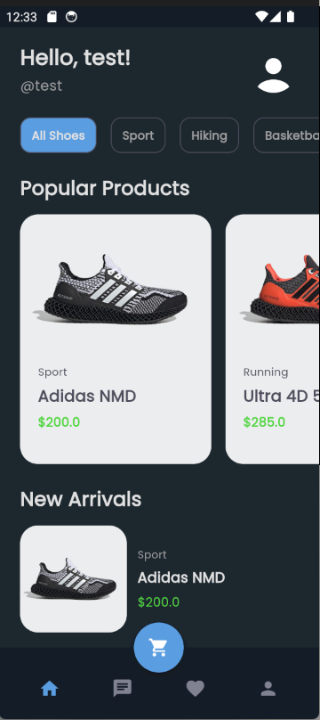
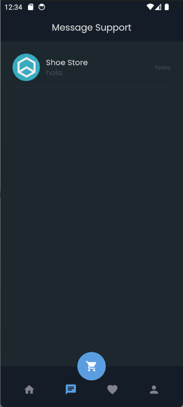
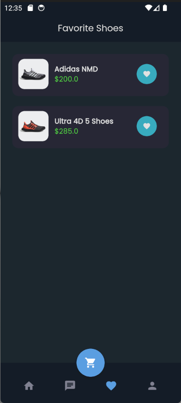
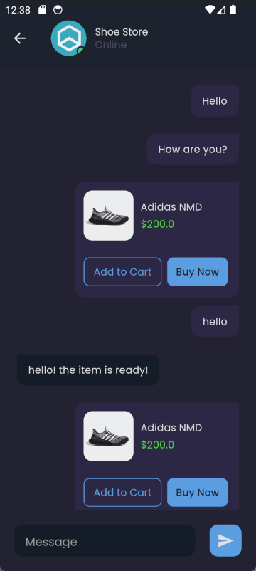
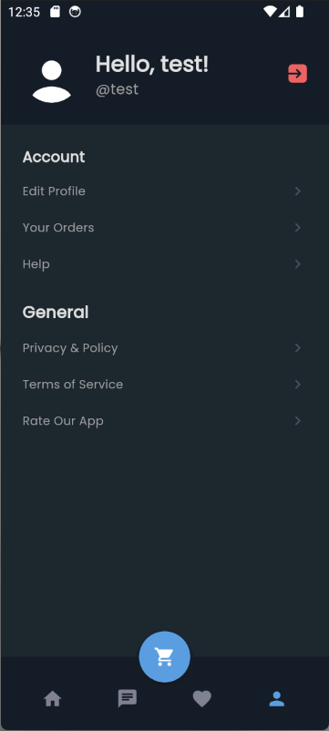

---


# Shoesee: Shoes E-commerce Mobile App

**Shoesee** is a mobile e-commerce app built with Flutter, Laravel, and MySQL, designed for seamless user experiences in buying and selling shoes. The app includes modern e-commerce features such as real-time chat, wishlists, and a shopping cart.

## Features

- **Real-time Chat**: Instant messaging between buyers and sellers for better customer engagement.
- **Wishlist**: Users can save their favorite products for easy access later.
- **Shopping Cart**: A fully integrated cart system to manage user purchases.
- **User Authentication**: Secure login and registration system.
- **Product Listings**: Display detailed product information including images, prices, and descriptions.

## Tech Stack

- **Frontend**: Flutter for a responsive, cross-platform mobile UI.
- **Backend**: Laravel for server-side operations and API management.
- **Database**: MySQL for efficient data storage and retrieval.

## Getting Started

### Prerequisites

1. [Flutter SDK](https://flutter.dev/docs/get-started/install)
2. [Laragon](https://laragon.org/docs/install) for Laravel dependencies and MySQL database.

### Installation

#### 1. Clone the Repository

```bash
git clone https://github.com/yourusername/shoesee.git
cd shoesee
```

#### 2. Set Up the Backend

1. Navigate to the `shoesee-app-be` directory [Shoesee Backend](https://github.com/dzakyadlh/shoesee-app-be).
2. Clone repository and install dependencies:

```bash
composer install
```

3. Configure your `.env` file with your MySQL database credentials.
4. Run the migration:

```bash
php artisan migrate
```

5. Start the Laravel server:

```bash
php artisan serve
```

#### 3. Set Up the Frontend

1. Navigate to the `mobile_app` directory.
2. Install Flutter dependencies:

```bash
flutter pub get
```

3. Run the app on an emulator or a physical device:

```bash
flutter run
```

### Environment Variables

Ensure the backend `.env` file includes the following:

```plaintext
DB_CONNECTION=mysql
DB_HOST=127.0.0.1
DB_PORT=3306
DB_DATABASE=shoesee_db
DB_USERNAME=your_db_username
DB_PASSWORD=your_db_password
```

## Project Structure

### Backend (Laravel)

```plaintext
backend/
├── app/                # Core application code
├── config/             # Configuration files
├── database/           # Migrations and seeders
├── public/             # Public assets (e.g., product images)
├── routes/             # Web and API route files
└── .env                # Environment configuration
```

### Frontend (Flutter)

```plaintext
mobile_app/
├── lib/
│   ├── main.dart       # Main entry point
│   ├── theme.dart      # App styling
│   ├── screens/        # UI screens (e.g., HomeScreen, ProductDetailScreen)
│   ├── services/       # API integration services
│   ├── providers/      # API integration providers
│   ├── models/         # Data models (e.g., Product, User)
│   └── widgets/        # Custom reusable widgets (e.g., ProductCard, ChatBubble)
└── pubspec.yaml        # Project configuration and dependencies
```

## Screenshots

|  |  |  |
|--------------------------------------------------|---------------------------------------------------|------------------------------------------------------------|
|  |  |  |
|  | 

## API Endpoints

| Endpoint              | Method | Description                 |
|-----------------------|--------|-----------------------------|
| `/api/user`           | GET    | Fetch all user              |
| `/api/user`           | POST   | Update a user               |
| `/api/login`          | POST   | Sign In                     |
| `/api/register`       | POST   | Sign Up                     |
| `/api/logout`         | POST   | Log out                     |
| `/api/categories`     | GET    | Fetch all categories        |
| `/api/products`       | GET    | Fetch all products          |
| `/api/products/{id}`  | GET    | Fetch product details       |
| `/api/transaction`    | POST   | Fetch transactions          |
| `/api/wishlist`       | GET    | Retrieve user's wishlist    |
| `/api/checkout`       | POST   | Save transaction data       |

---
